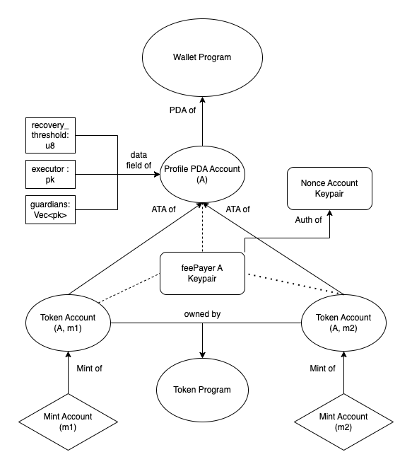

# Krypton Wallet Smart Contract

Introducing Krypton, a Solana smart contract wallet with multisig social recovery, eliminating fear of losing your private key and improving usability and security with advanced features.

## Key Features

- Self custody without seed phrases (not good user experience)
- Social recovery with guardians (people, secondary wallet)
- Setting transaction limit to prevent wallets being emptied
- Ability to interact with arbitrary smart contracts

## Flow Diagram

## Instructions

- Refer to `program/src/instruction/mod.rs` to view the `shank-account` bindings for all available instructions
- The generated IDL can be found under `js/idl/krypton.json`

## Instructions to run locally

1. In the `program` directory and run `cargo-build-sbf` and `cargo build`
2. If the state or instructions or accounts to instructions change: navigate to `js` and run `npm run api:gen`
3. To start amman, navigate to `tests` and run `npx amman start`
4. To run a custom `[test].ts` test, navigate to the directory and run `npx ts-node [test].ts`  **NOTE**: Ensure node version 16 using `nvm use 16`
